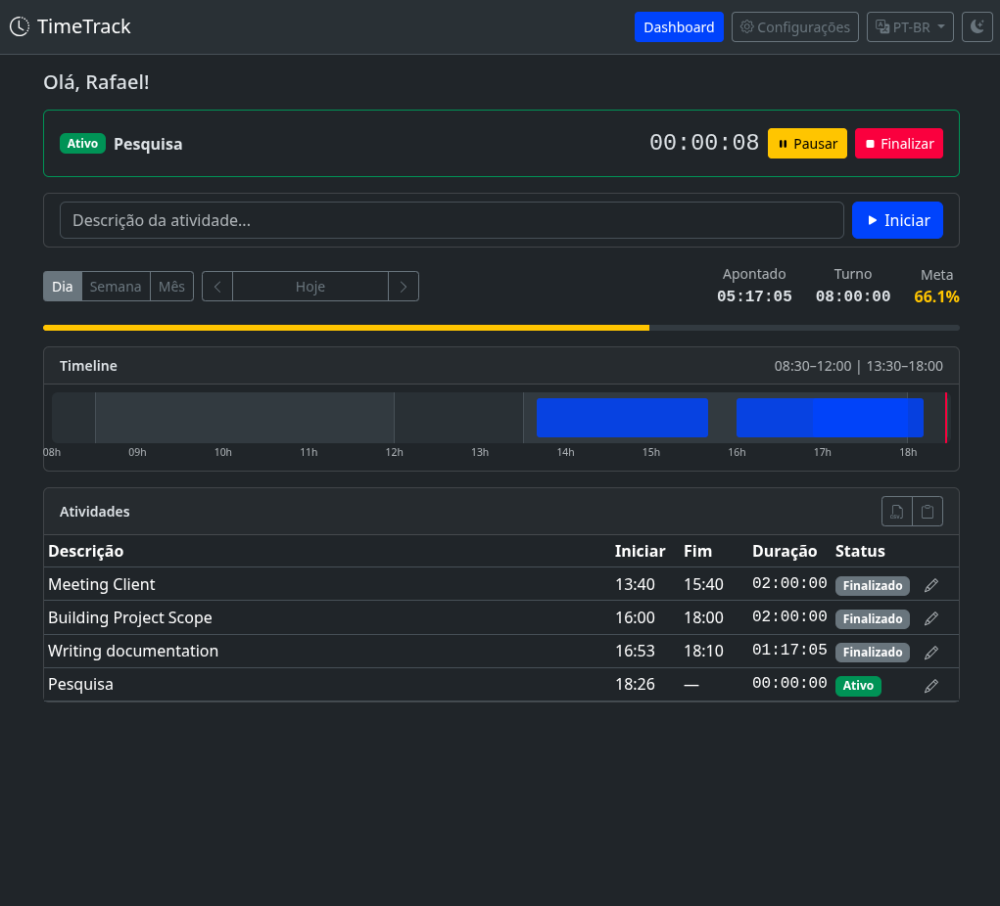
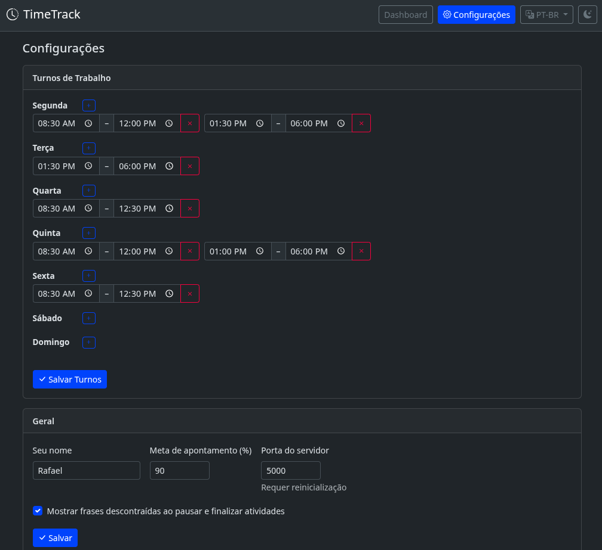

# Job Tracker

[](https://github.com/rafaelkrause/job_tracker/actions/workflows/ci.yml)
[](https://github.com/rafaelkrause/job_tracker/actions/workflows/codeql.yml)
[](https://rafaelkrause.github.io/job_tracker/)
[](https://www.python.org/downloads/)
[](LICENSE)
[](https://github.com/astral-sh/ruff)
[](https://claude.ai/claude-code)

A lightweight, self-hosted hour-tracking tool that runs as a background process and serves a local web UI at `http://localhost:5000`. Built for single-user, low-footprint use on Linux, macOS and Windows.

📘 **Documentation / Documentação:** [rafaelkrause.github.io/job_tracker](https://rafaelkrause.github.io/job_tracker/) (pt-BR + English)

## Download & install

### Windows

1. Download the latest installer: **[JobTracker-Setup.exe](https://github.com/rafaelkrause/job_tracker/releases/latest)**
2. Run it. Per-user install, no admin required. SmartScreen may warn — click **More info → Run anyway**.
3. Launch from the Start Menu or desktop shortcut.

Data lives in `%APPDATA%\JobTracker`, is preserved across updates, and the installer bundles an embedded Python runtime (no system Python required).

### Linux / macOS

```bash
curl -fsSL https://raw.githubusercontent.com/rafaelkrause/job_tracker/main/install-remote.sh | bash
```

One-liner that downloads the latest release, installs it into `~/.local/share/job-tracker/.venv`, and drops a `job-tracker` launcher on your `PATH`. Add `--service` to start the app at login via `systemd --user` (Linux) or `LaunchAgent` (macOS).

Requires Python 3.10+ (`python3 --version`). On Ubuntu/Debian: `sudo apt install python3 python3-venv`. On macOS: `brew install python@3.11` (or [python.org](https://www.python.org/downloads/)).

Uninstall: `bash -s -- --uninstall` (keeps data) or `--uninstall --purge-data` (wipes it). Full details in the [installation guide](https://rafaelkrause.github.io/job_tracker/installation/).

## Screenshots


*Daily dashboard — current activity, timeline, shift progress and target.*


*Settings — shifts per weekday, theme, target percentage and preferences.*

## Features

- Start / pause / resume / stop activities with a state machine that subtracts pause intervals from wall-clock time
- Dashboard with day / week / month views, timeline (day), shift-aware progress, and target percentage
- Monthly JSON storage (no database, no ORM) — one file per month under `data/`
- Configurable weekly shifts, port, theme (light / dark / auto), and target percentage
- CSV / TSV export for completed activities over a date range
- System tray with pause / resume / stop actions
- Auto-opens the browser on startup (disable with `--no-browser`)

## Requirements

- Python 3.10+
- Flask 3.0+
- `pystray` and `Pillow` for the system-tray icon (installed automatically)

## Language / Idioma

The application UI and documentation are **bilingual** (English + Brazilian Portuguese, default `pt-BR`). The codebase itself (identifiers, comments, docstrings) is in English.

A aplicação e a documentação são **bilíngues** (inglês + português do Brasil, default `pt-BR`). O código-fonte (identificadores, comentários, docstrings) é em inglês.

## From source (contributors)

```bash
git clone https://github.com/rafaelkrause/job_tracker.git
cd job_tracker
./install.sh
```

Or with the modern packaging workflow:

```bash
python3 -m venv .venv
source .venv/bin/activate
pip install -e "."                  # runtime
# For development:
pip install -e ".[dev]"
```

Once installed, the `job-tracker` command is on your PATH:

```bash
job-tracker --no-browser
```

To build the Windows installer from source (Linux host):

```bash
sudo apt install nsis
./installer/build_installer.sh 1.0.0
# → installer/JobTracker-Setup-1.0.0.exe
```

## Running

```bash
python3 run.py               # starts the server and opens the browser
python3 run.py --no-browser  # starts the server without opening a browser
```

The server listens on `http://127.0.0.1:5000` by default. The tray icon owns the main thread and Flask runs in a daemon thread; on headless systems with no window manager the app falls back to running Flask in the foreground.

A `job-tracker.sh` helper is included for launching from the Linux shell.

## Configuration

On first run a `config.json` is created at the project root with sensible defaults. Edit it directly or use the `/settings` page in the web UI.

```json
{
  "shifts": {
    "monday":    [{"start": "09:00", "end": "12:00"}, {"start": "13:00", "end": "18:00"}],
    "tuesday":   [{"start": "09:00", "end": "12:00"}, {"start": "13:00", "end": "18:00"}],
    "wednesday": [{"start": "09:00", "end": "12:00"}, {"start": "13:00", "end": "18:00"}],
    "thursday":  [{"start": "09:00", "end": "12:00"}, {"start": "13:00", "end": "18:00"}],
    "friday":    [{"start": "09:00", "end": "12:00"}, {"start": "13:00", "end": "18:00"}],
    "saturday":  [],
    "sunday":    []
  },
  "theme": "auto",
  "port": 5000,
  "target_percentage": 90
}
```

## Data layout

- `data/YYYY-MM.json` — one file per month, holding that month's activities
- `config.json` — user configuration, auto-generated on first run

Both are gitignored; your activity history stays local.

## API reference

```
POST /api/activity/start      body: {"description": "..."}  (auto-stops any running activity)
POST /api/activity/pause
POST /api/activity/resume
POST /api/activity/stop
GET  /api/activity/current
GET  /api/dashboard?date=YYYY-MM-DD[&period=day|week|month]
GET  /api/export?from=YYYY-MM-DD&to=YYYY-MM-DD&format=csv|tsv
GET  /api/shifts
PUT  /api/shifts
PUT  /api/config
```

## Project layout

```
job_tracker/
├── run.py                 # entry point
├── requirements.txt
├── config.json            # user config (auto-generated, gitignored)
├── data/                  # monthly activity JSON (gitignored)
└── app/
    ├── __init__.py        # Flask app factory
    ├── config.py          # config load/save with defaults
    ├── models.py          # Activity / Pause dataclasses + state machine
    ├── storage.py         # monthly JSON persistence
    ├── routes.py          # REST API + HTML pages
    ├── export.py          # CSV/TSV export
    ├── tray.py            # system tray integration
    ├── static/
    └── templates/
```

## Design notes

- Starting a new activity auto-finalizes the current one — no blocking prompts.
- Shift-elapsed % only counts time already passed in the current day, so future hours don't drag the progress bar down.
- The dashboard timeline range is derived from the day's shift configuration with 30-minute padding.
- All timestamps are stored as ISO 8601 with a timezone offset; duration is wall-clock minus pause intervals.
- Monthly partitioning keeps individual JSON files small and easy to inspect by hand.

## Credits / Third-party

### Runtime dependencies (Python)

| Package | Version | License | Purpose |
|---|---|---|---|
| [Flask](https://flask.palletsprojects.com/) | `>=3.0` | BSD-3-Clause | Web framework (server, routing, templating) |
| [Flask-Babel](https://python-babel.github.io/flask-babel/) | `>=4.0` | BSD-3-Clause | i18n/l10n (pt-BR + EN) |
| [pystray](https://github.com/moses-palmer/pystray) | `>=0.19` | LGPL-3.0 | System-tray icon |
| [Pillow](https://python-pillow.org/) | `>=10.0` | MIT-CMU (HPND) | Tray-icon rendering (pystray dependency) |

### Frontend libraries (loaded from CDN)

| Asset | Version | License | Source |
|---|---|---|---|
| [Bootstrap](https://getbootstrap.com/) (CSS + JS bundle) | `5.3.3` | MIT | `cdn.jsdelivr.net/npm/bootstrap@5.3.3` |
| [Bootstrap Icons](https://icons.getbootstrap.com/) | `1.11.3` | MIT | `cdn.jsdelivr.net/npm/bootstrap-icons@1.11.3` |

No external web fonts are loaded — the UI uses each OS's native font stack (`system-ui, -apple-system, "Segoe UI", Roboto, …`) inherited from Bootstrap 5.

### Icons used

Icons come exclusively from [Bootstrap Icons](https://icons.getbootstrap.com/) (MIT). Glyphs currently referenced: `clock-history`, `gear`, `translate`, `circle-half`, `moon-stars-fill`, `sun-fill`, `pause-fill`, `play-fill`, `stop-fill`, `chevron-left`, `chevron-right`, `filetype-csv`, `clipboard`, `trash`, `pencil`, `pencil-square`, `check-lg`, `download`, `plus`, `x`, `exclamation-triangle`.

### Motivational phrases

The micro-reward phrases served by `/api/phrase/<category>` (shown after *pause* and *stop* actions) are bundled under `app/data/`:

- `phrases_pt_br.json` — 20 pause + 20 stop phrases (pt-BR)
- `phrases_en.json` — 20 pause + 20 stop phrases (EN)

All phrases are **original content**, written for this project and distributed under the project's MIT license. They can be toggled off via the `phrases_enabled` setting.

### Build & packaging tooling

| Tool | Purpose |
|---|---|
| [Hatchling](https://hatch.pypa.io/) | PEP 517 build backend |
| [NSIS](https://nsis.sourceforge.io/) | Windows installer script compiler |
| [NSSM](https://nssm.cc/) `2.24` | Optional Windows-service wrapper (bundled into the installer) |
| [Python embeddable](https://www.python.org/downloads/) `3.11` | Portable Python runtime bundled into the Windows installer |

### Developer & documentation tooling

| Tool | Purpose |
|---|---|
| [ruff](https://docs.astral.sh/ruff/) | Lint + format |
| [mypy](https://mypy.readthedocs.io/) | Type checking |
| [pytest](https://docs.pytest.org/) + [pytest-cov](https://pytest-cov.readthedocs.io/) | Tests + coverage |
| [pre-commit](https://pre-commit.com/) | Git hook orchestration |
| [Babel](https://babel.pocoo.org/) | Catalog extraction / compilation |
| [MkDocs Material](https://squidfunk.github.io/mkdocs-material/) `>=9.5` | Documentation theme |
| [mkdocs-static-i18n](https://github.com/ultrabug/mkdocs-static-i18n) `>=1.2` | Bilingual docs (pt-BR + EN) |

The documentation site additionally uses [Material Design Icons](https://pictogrammers.com/library/mdi/) and [Font Awesome](https://fontawesome.com/) brand icons, both shipped with MkDocs Material.

## License

[MIT](LICENSE) © 2026 Rafael Krause

Third-party assets remain under their original licenses as listed above.
